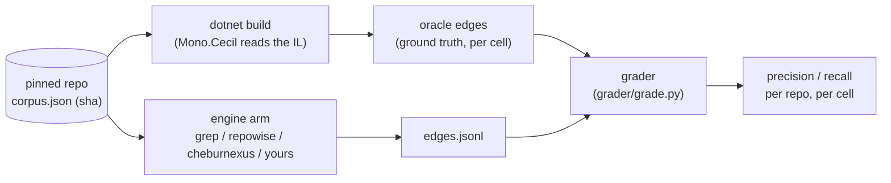

<p align="center">
  <a href="README.ru.md">Русский</a>
</p>

<p align="center">
  <picture>
    <source media="(prefers-color-scheme: dark)" srcset="assets/banner-dark.svg">
    <source media="(prefers-color-scheme: light)" srcset="assets/banner-light.svg">
    
  </picture>
</p>

<p align="center">
  A polygon that scores code-analysis engines against a call graph pulled from compiled IL,
  not from another engine's opinion.
</p>

<p align="center">
  <a href="LICENSE"></a>
  
  
  
</p>

<p align="center">
  <a href="#quickstart">Quickstart</a> •
  <a href="#results">Results</a> •
  <a href="#add-your-engine">Add your engine</a> •
  <a href="#methodology">Methodology</a> •
  <a href="#limitations">Limitations</a>
</p>

Every "our index finds the right callers" claim in this field is graded against an answer key the
publisher wrote themselves. That is the defect this repository exists to fix: the answer key here
is compiled, not opined. For C#, it is read out of the actual IL the compiler emitted — `dotnet
build`, then Mono.Cecil walks the assembly, and every call site is anchored back to a source line
through the PDB. Anyone with the .NET SDK rebuilds the exact same pinned commit and gets the exact
same answer key. Nobody's engine, including ours, gets a vote in what the truth is.

## Methodology



- **The corpus** is a short list of pinned, permissively-licensed open-source repositories
  (`corpus.json`), each locked to one commit SHA. Nobody moves the target after a number is
  published.
- **The oracle** is the compiled answer key: `oracle/csharp` for C# (Mono.Cecil over IL + PDBs),
  `oracle/typescript` for TypeScript (a runtime shadow-stack that records the calls a test run
  actually made — see [Limitations](#limitations), this one is not exhaustive).
- **An arm** is one engine under test, run through the shared CLI contract in
  `arms/ARCHITECTURE.md`. `grep` and `repowise` are free and run live for anyone. `cheburnexus` is
  our own closed product: live for us, **replayed** from committed `edges.jsonl` rows for everyone
  else — see "Auditable, not rerunnable" below.
- **The grader** (`grader/grade.py`) matches an arm's edges against the oracle's, by a fixed
  identity key, and reports precision/recall per cell. The matching rules — what counts as the
  same edge, what is excluded from the comparable set, what virtual-dispatch override map is
  applied — are fixed in `grader/EDGE_FORMAT.md` before any run, not tuned after seeing a number.
- **Cells.** Every repository is measured twice: `without-tests` (product code only) and
  `with-tests` (product + test code), because a tool's numbers usually fall hardest on the
  with-tests cell and that is not allowed to be quietly skipped.

### Auditable, not rerunnable

The Cheburnexus engine itself is a commercial product; its binary is not published here. What is
published, for every arm including ours: the corpus pins, the oracle builder, the grader, and the
raw per-edge output. A sceptic rebuilds the answer key from the pinned commit, re-grades every
published row with their own copy of `grader/grade.py`, and runs the two free arms end to end.
What they cannot do without a licence is regenerate our rows from scratch — the claim made here is
that the numbers are **auditable, not rerunnable**.

### How to read the numbers

- **Precision** = matched edges ÷ edges the arm emitted, in one cell.
- **Recall** = matched edges ÷ edges the oracle expects, in that same cell.
- **The comparable set** excludes, and separately counts, calls to a property accessor
  (`get_`/`set_`), the `foreach` enumerator protocol, compiler-generated callees, and calls outside
  the pinned corpus — see `grader/EDGE_FORMAT.md`, "The comparable set". This boundary moves the
  denominator by roughly 10x, which is why it is written down before any run rather than picked
  afterward.
- **`declared`** is a column, not a score adjustment: an arm may say next to its edges how many
  call sites it saw but could not resolve (`<edges>.jsonl.coverage.json`). A blank cell means the
  arm made no statement about its own blind spots — not that it has none.
- **`dropped`** counts arm rows whose caller couldn't be confidently mapped back to a user-written
  method (the same rule the oracle itself applies to compiler-generated callers like lambdas and
  iterators). Dropped rows count for nobody, on either side.
- **Identity.** A method key is `Namespace.Type::Method` — parameter types are dropped, so
  overloads collapse into one node. This inflates every arm's precision a little, ours included; it
  is a stated trade-off, not an oversight — see `grader/EDGE_FORMAT.md`, "Identity".

## Results

> [!NOTE]
> Numbers below are placeholders. Real results live in `results/published/<arm>/<repo>/<cell>/edges.jsonl`,
> committed to this repository once a run is complete. Rebuild the oracle from the pinned commit,
> point `grader/grade.py` at a published `edges.jsonl`, and you get the same precision/recall this
> table would show — nobody has to take our numbers on faith.

<p align="center">
  <picture>
    <source media="(prefers-color-scheme: dark)" srcset="assets/results-dark.svg">
    <source media="(prefers-color-scheme: light)" srcset="assets/results-light.svg">
    
  </picture>
</p>

Precision / recall, primary cell, `without-tests`:

| repo | language | license | grep | repowise | cheburnexus |
|---|---|---|---|---|---|
| serilog/serilog | C# | Apache-2.0 | TBD | TBD | TBD |
| App-vNext/Polly | C# | BSD-3-Clause | TBD | TBD | TBD |
| FluentValidation/FluentValidation | C# | Apache-2.0 | TBD | TBD | TBD |
| Humanizr/Humanizer | C# | MIT | TBD | TBD | TBD |
| jbogard/MediatR | C# | RPL-1.5 ⚠️ | TBD | TBD | TBD |
| AutoMapper/AutoMapper | C# | RPL-1.5 ⚠️ | TBD | TBD | TBD |
| typestack/class-validator | TypeScript | MIT | TBD | — | TBD (cheburnexus-ts) |
| colinhacks/zod | TypeScript | MIT | TBD | — | TBD (cheburnexus-ts) |
| vuejs/core | TypeScript | MIT | TBD | — | TBD (cheburnexus-ts) |

`repowise` only reads C#, so TypeScript rows show `—`. Two entries carry the **RPL-1.5** licence
(a copyleft licence, not permissive) — see [License](#license) for what that means for those two
rows specifically.

## Quickstart

Prerequisites: **Python 3** (standard library only — no `pip install` needed for `grep`, the
runner, or the grader), **.NET SDK 8.x** (the pinned corpus commits are verified against
`8.0.421`; see `CORPUS_NOTES.md` — some upstream repos' tip-of-main needs an unreleased SDK, which
is exactly why every corpus entry is pinned to a commit known to build on SDK 8), and `git`.

Fetch one corpus repository at its pinned commit (`serilog`, per `corpus.json`) and build it:

```sh
git clone https://github.com/serilog/serilog.git corpus/serilog
git -C corpus/serilog checkout 4c9a312bc72e335897553472d0a2e91819bc51b1
dotnet build corpus/serilog/Serilog.sln -c Release
```

Build the oracle tool once (the runner invokes it with `--no-build`):

```sh
dotnet build -c Release oracle/csharp
```

Run the grep arm and grade it against the oracle, in one command:

```sh
python3 runner/run.py --checkouts corpus --only serilog --arms grep --cells without-tests
```

This builds the answer key for `serilog`/`without-tests` from the checkout you just built, runs
`arms/grep/run.py` over the same checkout, grades the result, and prints a
`repo / cell / arm / mode / precision / recall / declared` table — see
["How to read the numbers"](#how-to-read-the-numbers). Drop `--only serilog --arms grep` to run
every pinned repository against every live arm.

## Add your engine

An arm is one program behind a fixed CLI contract (`arms/ARCHITECTURE.md`). It never sees the
oracle — it gets a checkout and a cell name, and hands back edges.

```sh
python3 arms/<name>/run.py --repo <checkout> --cell with-tests|without-tests --out <edges.jsonl>
python3 arms/<name>/run.py --describe
```

- writes JSON Lines, one call edge per line, in the format below;
- writes nothing else to stdout — diagnostics go to stderr;
- **exit `0`** having produced *no* edges when the tool genuinely searched and found nothing — a
  real result, not a failure;
- **exit `3`** when the tool ran but was refused the data (a licence wall, a disabled feature) —
  raise `armkit.Blocked`, which the shared CLI turns into this exit code automatically;
- **exit `2`** when the tool could not run at all;
- **never reads** `oracle/`, any `*-oracle.jsonl`, or `overrides.json` — the answer key, in any
  form. The one documented exception is `corpus.json`'s `product_projects`/
  `test_assemblies_projects` fields, read through `armkit.source_files`/`armkit.in_scope` to scope
  the search to the repository's own declared product/test code — never a graded result;
- answers `--describe` with one JSON object: `{"name", "version", "mode": "live"|"replay"}`. This
  line is copied verbatim into the run manifest, so a result always says what produced it.

### Edge format

One JSON object per line (`grader/EDGE_FORMAT.md`):

```json
{"caller": "Serilog.Core.Logger::Write", "caller_file": "src/Serilog/Core/Logger.cs",
 "caller_line": 412, "callee": "Serilog.Core.Sinks.SafeAggregateSink::Emit"}
```

| field | required | meaning |
|---|---|---|
| `caller` | yes | enclosing method of the call site, `Namespace.Type::Method` |
| `callee` | yes | the called method, same shape |
| `caller_file` | no | repo-relative, forward slashes |
| `caller_line` | no | 1-based |

**Identity key rules:** `Namespace.Type::Method` — parameter types are *not* part of the key
(overloads collapse into one node); generic arity is kept when unambiguous (`Foo.Cache\`1::Get`);
a constructor is `.ctor` / a static constructor is `.cctor`; a property/indexer/event accessor
caller is named `get_X`/`set_X`/`add_X`/`remove_X` (`init` also spells as `set_X` — there is no
separate init-method in IL). Full detail, including the explicit-interface-implementation spelling
and known deviations, is in `grader/EDGE_FORMAT.md`.

**Forbidden inputs**, repeated because it is the one rule that would make a result meaningless:
never read `oracle/`, `*-oracle.jsonl`, or `overrides.json`.

**Optional coverage sidecar** — `<edges>.jsonl.coverage.json`, next to your output, if your engine
can say how much it could not resolve:

```json
{"is_exact": false, "reason": "unresolved_call_sites", "unresolved_call_sites": 412}
```

The runner prints this as its own `declared` column and never folds it into recall — see
["How to read the numbers"](#how-to-read-the-numbers).

### A minimal arm, based on `arms/grep/run.py`

```python
#!/usr/bin/env python3
import sys
from pathlib import Path

sys.path.insert(0, str(Path(__file__).resolve().parent.parent / "_lib"))
import armkit  # Edge, source_files, main() — the shared CLI, cell split, and row writer


def collect(repo_root: Path, cell: str):
    for path in armkit.source_files(repo_root, cell):
        # ... find call sites in `path`, resolve caller/callee as best you can ...
        yield armkit.Edge(
            caller="Namespace.Type::Method",
            callee="Namespace.Other::Method",
            caller_file=str(path.relative_to(repo_root).as_posix()),
            caller_line=42,
        )


def version() -> str:
    return "my-engine-0.1"


if __name__ == "__main__":
    sys.exit(armkit.main(name="my-engine", version=version, collect=collect, mode="live"))
```

### Registering it

Save this as `arms/<name>/run.py`; the runner finds it by that path convention
(`runner/run.py`'s `run_arm`). Pass it explicitly — `--arms my-engine` — or add it to the default
list in `runner/run.py` (`--arms`'s default is `["grep", "repowise", "cheburnexus"]`).

### Submitting results

Open a PR adding your published rows under `results/published/<name>/<repo>/<cell>/edges.jsonl`
(this is the one path `.gitignore` carves an exception for out of the otherwise-ignored `results/`
directory) — that lets anyone regrade your arm without running it, exactly like the `cheburnexus`
replay path.

## Limitations

> [!WARNING]
> - **Reflection and DI are invisible to both sides.** A call resolved only at runtime — a service
>   locator, a DI container wiring an interface to an implementation, `Activator.CreateInstance`
>   — has no static call instruction in the IL, so the oracle never sees it either. This is a
>   shared blind spot between the answer key and every arm, not a defect scored against one engine.
> - **The `cheburnexus` arm is replay-only for anyone without a licence.** Its rows are published
>   and regradable, but not regeneratable from scratch on this machine — see
>   ["Auditable, not rerunnable"](#auditable-not-rerunnable).
> - **The TypeScript oracle's recall is bounded by test coverage.** It is not an exhaustive static
>   key like the C# one: it instruments the corpus with a runtime shadow-stack
>   (`oracle/typescript`, `AsyncLocalStorage`-based) and records only the calls the corpus's *own
>   test suite actually executes*. A real call on a code path no test exercises is invisible to
>   this oracle too, so a TypeScript recall number reflects the corpus's test coverage as much as
>   the engine's actual recall — see `oracle/typescript/README.md` for the mechanism and its
>   measured gaps.

<details>
<summary>Advanced: flags and repo layout</summary>

### `runner/run.py`

```
--corpus CORPUS          path to corpus.json (default: ./corpus.json)
--checkouts CHECKOUTS    directory holding <repo>/ checkouts (default: ./corpus)
--out OUT                results directory (default: results/<UTC timestamp>)
--arms [ARMS ...]        which arms to run (default: grep repowise cheburnexus)
--only [ONLY ...]        limit to these repository names
--cells [{without-tests,with-tests} ...]
```

### `grader/grade.py`

```
--oracle ORACLE          oracle.jsonl
--arm ARM                the arm's edges.jsonl
--first-party [...]      assembly names of the corpus; omit to treat every callee as in-corpus
--overrides OVERRIDES    the oracle's virtual-dispatch override map
--json JSON              write the result as JSON too
--executed-only          runtime oracles only (TypeScript) — see the flag's own --help text
```

### Repo layout

```
corpus.json           the pinned repositories: sha, license, build command, product/test scope
CORPUS_NOTES.md        how each pin was verified to build cleanly
corpus-patches/         the (documented) source patches a couple of pins needed to build at all
oracle/csharp/          the C# answer key: IL -> call edges -> source anchors (Mono.Cecil)
oracle/typescript/      the TypeScript answer key: runtime shadow-stack instrumentation
arms/ARCHITECTURE.md    the arm contract, live vs. replay, cells — read this before arms/<name>/
arms/grep/               the baseline arm — simplest arm, read it as a template
arms/repowise/           the competitor, pinned by version
arms/cheburnexus/        our own C# engine's arm (closed engine, open adapter code)
arms/cheburnexus-ts/     our own TypeScript engine's arm
arms/_lib/armkit.py      shared CLI/cell-split/row-writer plumbing every arm uses
grader/grade.py          the scorer; grader/EDGE_FORMAT.md documents every rule it applies
grader/bucket.py         decomposes a published result.json by cause, without recomputing it
runner/run.py            drives one repo/cell/arm end to end: oracle -> arm -> grade -> report
run_tests.py             runs every suite in the polygon from one entry point
results/published/       the only part of results/ committed — regradable rows per arm/repo/cell
PREREGISTRATION-*.md      predictions committed before a run, graded on the same page as the result
```

</details>

## License

This repository's own code — the corpus pins, the oracle builders, the grader, the runner, and the
open arms — is [MIT-licensed](LICENSE), copyright © 2026 Alexey.

That licence does **not** extend to:

- the pinned repositories under `corpus/` (not committed — fetched by the reader per
  `corpus.json`). Each keeps its own upstream licence: most of this corpus is Apache-2.0,
  BSD-3-Clause, or MIT, but two entries (`jbogard/MediatR`, `AutoMapper/AutoMapper`) are licensed
  under **RPL-1.5**, a reciprocal/copyleft licence — check `corpus.json` and that repository's own
  licence file before reusing anything beyond running this benchmark against the pinned commit;
- the Cheburnexus engine binary, which is closed-source and never distributed here — see
  ["Auditable, not rerunnable"](#auditable-not-rerunnable).
