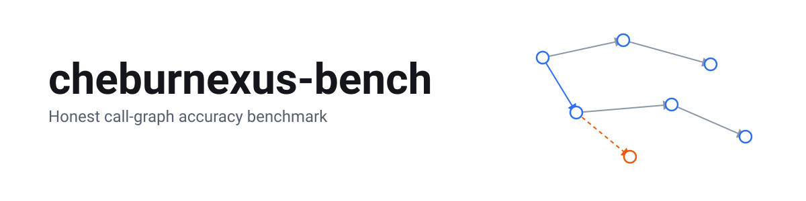
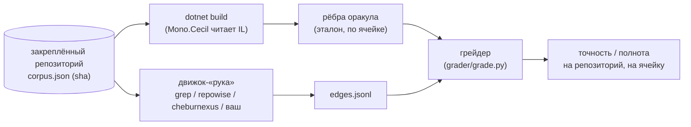
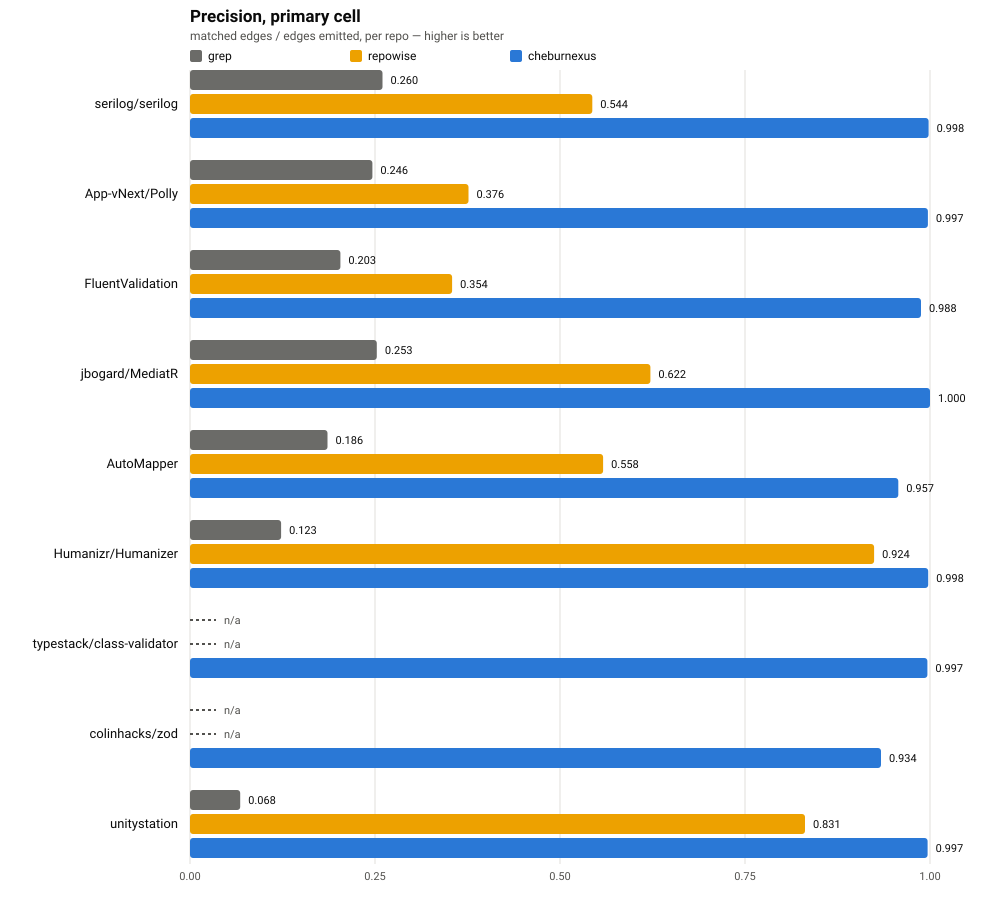

<p align="center">
  <a href="README.md">English</a>
</p>

<p align="center">
  <picture>
    <source media="(prefers-color-scheme: dark)" srcset="assets/banner-dark.svg">
    <source media="(prefers-color-scheme: light)" srcset="assets/banner-light.svg">
    
  </picture>
</p>

<p align="center">
  Полигон, который проверяет движки анализа кода против графа вызовов из скомпилированного IL,
  а не против мнения другого движка.
</p>

<p align="center">
  <a href="LICENSE"></a>
  
  
  
</p>

<p align="center">
  <a href="#с-чего-начать">С чего начать</a> •
  <a href="#результаты">Результаты</a> •
  <a href="#добавить-свой-движок">Добавить свой движок</a> •
  <a href="#методология">Методология</a> •
  <a href="#ограничения">Ограничения</a>
</p>

В этой области любое заявление «наш индекс находит вызовы правильно» проверяется по ключу,
который написал сам автор инструмента. Это и есть дефект, который должен исправить этот
репозиторий: здесь ответ не придуман, а скомпилирован. Для C# ответ читается прямо из IL,
который выдал компилятор — `dotnet build`, затем Mono.Cecil читает сборку, и каждое место
вызова привязывается к строке исходника через PDB. Любой человек с .NET SDK соберёт тот же
самый зафиксированный коммит и получит тот же самый ответ. Ни один движок, включая наш, не
голосует за то, что считать правдой.

## Методология



- **Корпус** — короткий список закреплённых open-source репозиториев с разрешающей лицензией
  (`corpus.json`). Каждый зафиксирован на одном коммите (sha). После публикации числа цель
  никто не двигает.
- **Оракул** — скомпилированный ответ. `oracle/csharp` — для C# (Mono.Cecil читает IL и PDB).
  `oracle/typescript` — для TypeScript (записывает вызовы, которые реально произошли во время
  прогона тестов — смотри [«Ограничения»](#ограничения), этот оракул не исчерпывающий).
- **Рука** (arm) — один проверяемый движок. Запускается через общий CLI-контракт
  (`arms/ARCHITECTURE.md`). `grep` и `repowise` бесплатны и запускаются вживую у любого. Строки
  `cheburnexus` ниже — **проигрываются** из уже сохранённых `edges.jsonl`, чтобы их можно было
  перепроверить без копии движка. Смотри «Проверяемо, но не переигрываемо» ниже. С коммита
  движка `c00c1945` (2026-09-24) граф вызовов — функция, которую измеряет этот бенчмарк
  (`who_calls`, зависимости классов) — переехал в **бесплатный тариф CheburNexus**: лицензионный
  ключ больше не нужен. Любой может указать `CHEBURNEXUS_ENGINE` на бесплатный движок и
  прогнать эту руку вживую сам — смотри [«С чего начать»](#с-чего-начать).
- **Грейдер** (`grader/grade.py`) сверяет рёбра руки с рёбрами оракула по фиксированному ключу
  и считает точность/полноту по каждой ячейке. Правила сверки — что считать одним и тем же
  ребром, что исключить из сравнения, какую карту переопределений для виртуальных вызовов
  применить — зафиксированы в `grader/EDGE_FORMAT.md` до всякого прогона, а не подогнаны
  задним числом.
- **Ячейки.** Каждый репозиторий измеряется дважды: `without-tests` (только продуктовый код) и
  `with-tests` (продуктовый код плюс тесты) — потому что числа инструмента обычно хуже всего
  именно на ячейке с тестами, и её нельзя тихо пропустить.

### Проверяемо, но не переигрываемо

Бинарник движка Cheburnexus по-прежнему не публикуется в этом репозитории — это отдельная
загрузка (смотри заметку о бесплатном тарифе выше). Что публикуется здесь для каждой руки,
включая нашу: закреплённый корпус, сборщик оракула, грейдер и сырой вывод по каждому ребру.
Скептик пересобирает ответ из закреплённого коммита и перепроверяет каждую опубликованную
строку своей копией `grader/grade.py` — независимо от того, поставил он себе движок или нет.
Числа **проверяемы, но не переигрываемы, по конструкции** — даже теперь, когда `grep`,
`repowise` и бесплатный движок CheburNexus все трое запускаются вживую кем угодно.

### Как читать числа

- **Точность** = совпавшие рёбра ÷ рёбра, которые выдала рука, в одной ячейке.
- **Полнота** = совпавшие рёбра ÷ рёбра, которые ожидает оракул, в той же ячейке.
- **Сравниваемое множество** исключает — и отдельно считает — вызовы аксессора свойства
  (`get_`/`set_`), протокол перечисления `foreach`, сгенерированные компилятором цели вызова и
  вызовы за пределами закреплённого корпуса. Смотри `grader/EDGE_FORMAT.md`, раздел «The
  comparable set». Эта граница меняет знаменатель примерно в 10 раз — поэтому она записана
  заранее, а не подобрана после прогона.
- **`declared`** — это колонка, а не поправка к баллу: рука может сказать рядом со своими
  рёбрами, сколько мест вызова она увидела, но не смогла разрешить
  (`<edges>.jsonl.coverage.json`). Пустая ячейка значит, что рука ничего не заявила о своих
  слепых пятнах — не то, что их нет.
- **`dropped`** — строки руки, чей вызывающий метод нельзя уверенно привязать к написанному
  человеком методу (то же правило оракул применяет к сгенерированным компилятором вызывающим —
  лямбдам, итераторам). Такие строки не считаются ни за кого.
- **Идентичность.** Ключ метода — `Namespace.Type::Method`, без типов параметров: перегрузки
  схлопываются в один узел. Это немного завышает точность у любой руки, включая нашу — это
  осознанный компромисс, а не недосмотр. Смотри `grader/EDGE_FORMAT.md`, раздел «Identity».

## Результаты

> [!NOTE]
> Настоящие, перепроверяемые строки лежат в `results/published/<рука>/<репозиторий>/<ячейка>/`
> (`edges.jsonl` + `result.json` + `manifest.json`), закоммичены в этот репозиторий — смотри
> `results/published/SUMMARY.md`: там коммит движка, коммит бенчмарка, дата, хост. Пересобери
> оракул из закреплённого коммита, натрави `grader/grade.py` на опубликованный `edges.jsonl` —
> получишь те же точность и полноту, что и в этой таблице. Верить нам на слово не нужно.
> Строка `cheburnexus-ts` для `zod` пока не публикуется — идёт отдельное расследование (смотри
> заметку под таблицей); `grep`/`repowise` для `zod` опубликованы как обычно.

<p align="center">
  <picture>
    <source media="(prefers-color-scheme: dark)" srcset="assets/results-dark.svg">
    <source media="(prefers-color-scheme: light)" srcset="assets/results-light.svg">
    
  </picture>
</p>

Точность / полнота, основная ячейка, лучшая рука **жирным**:

| репозиторий | язык | лицензия | ячейка | grep | repowise | cheburnexus |
|---|---|---|---|---|---|---|
| serilog/serilog | C# | Apache-2.0 | without-tests | 0.260 / 0.542 | 0.544 / 0.348 | **0.998 / 1.000** |
| serilog/serilog | C# | Apache-2.0 | with-tests | 0.321 / 0.744 | 0.592 / 0.273 | **0.995 / 0.999** |
| App-vNext/Polly | C# | BSD-3-Clause | without-tests | 0.247 / 0.248 | 0.376 / 0.191 | **0.997 / 0.984** |
| FluentValidation/FluentValidation | C# | Apache-2.0 | without-tests | 0.203 / 0.385 | 0.354 / 0.183 | **0.988 / 0.918** |
| jbogard/MediatR | C# | RPL-1.5 | without-tests | 0.253 / 0.400 | 0.622 / 0.224 | **1.000 / 0.920** |
| AutoMapper/AutoMapper | C# | RPL-1.5 | without-tests | 0.186 / 0.410 | 0.558 / 0.224 | **0.957 / 0.685** |
| Humanizr/Humanizer | C# | MIT | without-tests | 0.123 / 0.238 | 0.925 / 0.239 | **0.998 / 0.400** |
| typestack/class-validator | TypeScript | MIT | with-tests | — / 0.000 | — / 0.000 | **0.997 / 0.563** (cheburnexus-ts) |
| colinhacks/zod | TypeScript | MIT | with-tests | — / 0.000 | — / 0.000 | разбираемся (cheburnexus-ts) |

> [!NOTE]
> **Ячейки.** `with-tests` отдельной строкой существует только для `serilog` — у остальных
> C#-репозиториев ячейка `with-tests` недоступна на закреплённом SDK (это зафиксировано, а не
> тихо пропущено — смотри заметки по каждому репозиторию в `corpus.json`). Оба TypeScript-репо —
> только `with-tests`: их оракул — рантайм-стек вызовов (`oracle/typescript`), ключ существует,
> только пока реально выполняются тесты, так что осмысленной ячейки «без тестов» для него
> попросту нет.

`grep` и `repowise` в строках TypeScript оба показывают «— / 0.000», но по разным причинам, а не
из-за одной общей ошибки: правила `grep` (`arms/grep/RULES.md`) сканируют только файлы `.cs`, так
что на TypeScript он честно не находит ни одного ребра — по конструкции. `repowise` рёбра
находит (18 на class-validator, 126 на zod), но TypeScript-оракул засчитывает только вызывающего,
которого тестовый набор реально выполнил, а ни один вызывающий `repowise` в это множество не
попадает — полный разбор в `results/published/SUMMARY.md`.

Два репозитория (`jbogard/MediatR`, `AutoMapper/AutoMapper`) идут под лицензией **RPL-1.5** —
это реципрокная (copyleft) лицензия, не разрешающая. Этот репозиторий не распространяет их
исходники: `corpus/` в `.gitignore`, а `corpus.json` закрепляет только URL и SHA коммита, которые
читатель скачивает сам — что RPL-1.5 значит при повторном использовании кода из этих двух
чекаутов, смотри в разделе [«Лицензия»](#лицензия).

## С чего начать

Нужны: **Python 3** (только стандартная библиотека — для `grep`, раннера и грейдера ставить
ничего не надо), **.NET SDK 8.x** (закреплённые коммиты корпуса проверены на `8.0.421`, смотри
`CORPUS_NOTES.md` — у некоторых репозиториев верхушка ветки требует ещё не вышедший SDK, именно
поэтому каждый коммит в корпусе закреплён на версии, которая точно собирается под SDK 8), и
`git`.

Скачай один репозиторий корпуса на закреплённом коммите (`serilog`, по `corpus.json`) и собери
его:

```sh
git clone https://github.com/serilog/serilog.git corpus/serilog
git -C corpus/serilog checkout 4c9a312bc72e335897553472d0a2e91819bc51b1
dotnet build corpus/serilog/Serilog.sln -c Release
```

Собери инструмент-оракул один раз (раннер вызывает его с `--no-build`):

```sh
dotnet build -c Release oracle/csharp
```

Запусти руку `grep` и сразу оцени её против оракула одной командой:

```sh
python3 runner/run.py --checkouts corpus --only serilog --arms grep --cells without-tests
```

Эта команда сама строит ответ для `serilog`/`without-tests` из только что собранного чекаута,
прогоняет `arms/grep/run.py` по нему же, оценивает результат и печатает таблицу
`repo / cell / arm / mode / precision / recall / declared` — смотри
[«Как читать числа»](#как-читать-числа). Убери `--only serilog --arms grep`, чтобы прогнать все
закреплённые репозитории через все живые руки.

### Запуск руки `cheburnexus` вживую

С коммита движка `c00c1945` (2026-09-24) граф вызовов — функция, которую измеряет этот
бенчмарк — переехал в бесплатный тариф CheburNexus: лицензионный ключ не нужен. Скачай
бесплатный движок из публичного репозитория релизов,
`https://github.com/Oberonru/cheburnexus-releases` (канонический адрес подтверждён, проверено на
релизе `v1.8.0`, 2026-09-24):

- **Windows (win-x64)**: скачай `cheburnexus-all-win-x64.zip` из последнего релиза и распакуй
  куда угодно. CLI — это `arch-computer.exe` в корне архива (рядом с
  `ArchitectureAnalyzer.CLI.dll` — не перепутай с `cheburnexus.exe`, это отдельный MCP-сервер,
  который лежит в том же архиве).
- **macOS (osx-x64)**: скачай вместо этого `cheburnexus-all-osx-x64.zip`; та же раскладка,
  `arch-computer` в корне.
- **Linux**: в этом релизе бинарника нет — только архивы win-x64 и osx-x64 (плюс архивы
  исходников, которые GitHub добавляет всегда). Собрать из исходников — пока единственный путь.

Дальше укажи раннеру путь до бинарника. PowerShell:

```powershell
$env:CHEBURNEXUS_ENGINE = "C:\путь\к\arch-computer.exe"
python3 runner/run.py --checkouts corpus --only serilog --arms cheburnexus --cells without-tests
```

bash:

```sh
CHEBURNEXUS_ENGINE=/путь/к/arch-computer.exe \
  python3 runner/run.py --checkouts corpus --only serilog --arms cheburnexus --cells without-tests
```

Это проверено вживую: с убранным лицензионным паспортом (условия бесплатного тарифа) публичный
бинарник win-x64 из `v1.8.0` в точности повторяет опубликованные числа для `serilog`/`without-tests`
(precision 0.998, recall 1.000, совпало 537 из 538).

Без `CHEBURNEXUS_ENGINE` `arms/cheburnexus/run.py` откатывается на опубликованные строки из
`results/published/cheburnexus/` — смотри
[«Проверяемо, но не переигрываемо»](#проверяемо-но-не-переигрываемо).

## Добавить свой движок

Рука (arm) — это одна программа за фиксированным CLI-контрактом (`arms/ARCHITECTURE.md`). Она
никогда не видит оракул: ей дают чекаут и имя ячейки, она отдаёт рёбра.

```sh
python3 arms/<имя>/run.py --repo <чекаут> --cell with-tests|without-tests --out <edges.jsonl>
python3 arms/<имя>/run.py --describe
```

- пишет JSON Lines, одно ребро вызова на строку, в формате ниже;
- ничего больше не пишет в stdout — диагностика идёт в stderr;
- **код выхода `0`**, если инструмент честно искал и ничего не нашёл — это настоящий результат,
  а не сбой;
- **код выхода `3`**, если инструмент запустился, но ему отказали в данных (лицензионная
  стена, отключённая функция) — подними `armkit.Blocked`, общий CLI сам превратит это в этот
  код выхода;
- **код выхода `2`**, если инструмент вообще не смог запуститься;
- **никогда не читает** `oracle/`, любой `*-oracle.jsonl` или `overrides.json` — ответ, в любом
  виде. Единственное задокументированное исключение — поля `product_projects`/
  `test_assemblies_projects` из `corpus.json`, через `armkit.source_files`/`armkit.in_scope`,
  чтобы ограничить поиск собственным продуктовым/тестовым кодом репозитория — это не
  оценённый результат;
- отвечает на `--describe` одним JSON-объектом: `{"name", "version", "mode": "live"|"replay"}`.
  Эта строка попадает без изменений в манифест прогона, так что по результату всегда видно,
  что его произвело.

### Формат ребра

Один JSON-объект на строку (`grader/EDGE_FORMAT.md`):

```json
{"caller": "Serilog.Core.Logger::Write", "caller_file": "src/Serilog/Core/Logger.cs",
 "caller_line": 412, "callee": "Serilog.Core.Sinks.SafeAggregateSink::Emit"}
```

| поле | обязательно | что значит |
|---|---|---|
| `caller` | да | метод, в котором находится место вызова, `Namespace.Type::Method` |
| `callee` | да | вызываемый метод, в том же виде |
| `caller_file` | нет | путь внутри репозитория, слэши прямые |
| `caller_line` | нет | нумерация строк с 1 |

**Правила ключа идентичности:** `Namespace.Type::Method` — типы параметров в ключ не входят
(перегрузки схлопываются в один узел); число generic-параметров сохраняется, если это
однозначно (`Foo.Cache\`1::Get`); конструктор — это `.ctor`, статический конструктор — `.cctor`;
вызывающий метод внутри аксессора свойства/индексатора/события называется
`get_X`/`set_X`/`add_X`/`remove_X` (у `init` тоже пишется `set_X` — в IL нет отдельного
init-метода). Все детали, включая написание явной реализации интерфейса и известные отклонения,
в `grader/EDGE_FORMAT.md`.

**Запрещённые входные данные** — повторяю отдельно, это единственное правило, из-за нарушения
которого результат теряет смысл: никогда не читать `oracle/`, `*-oracle.jsonl`,
`overrides.json`.

**Необязательный файл покрытия** — `<edges>.jsonl.coverage.json` рядом с твоим выводом, если
твой движок умеет сказать, сколько он не смог разрешить:

```json
{"is_exact": false, "reason": "unresolved_call_sites", "unresolved_call_sites": 412}
```

Раннер печатает это как свою колонку `declared` и никогда не подмешивает это в полноту — смотри
[«Как читать числа»](#как-читать-числа).

### Минимальная рука, на основе `arms/grep/run.py`

```python
#!/usr/bin/env python3
import sys
from pathlib import Path

sys.path.insert(0, str(Path(__file__).resolve().parent.parent / "_lib"))
import armkit  # Edge, source_files, main() — общий CLI, разбивка по ячейкам, запись строк


def collect(repo_root: Path, cell: str):
    for path in armkit.source_files(repo_root, cell):
        # ... найти места вызова в `path`, разрешить caller/callee как получится ...
        yield armkit.Edge(
            caller="Namespace.Type::Method",
            callee="Namespace.Other::Method",
            caller_file=str(path.relative_to(repo_root).as_posix()),
            caller_line=42,
        )


def version() -> str:
    return "my-engine-0.1"


if __name__ == "__main__":
    sys.exit(armkit.main(name="my-engine", version=version, collect=collect, mode="live"))
```

### Как зарегистрировать руку

Сохрани файл как `arms/<имя>/run.py` — раннер находит руку именно по этому пути (функция
`run_arm` в `runner/run.py`). Передай имя явно — `--arms my-engine` — или добавь в список по
умолчанию в `runner/run.py` (сейчас там `["grep", "repowise", "cheburnexus"]`).

### Как прислать результаты

Открой PR, который добавляет опубликованные строки в
`results/published/<имя>/<репозиторий>/<ячейка>/edges.jsonl` — это единственный путь, для
которого `.gitignore` делает исключение внутри игнорируемой папки `results/`. Так любой сможет
перепроверить твою руку без запуска — точно так же, как это устроено для `cheburnexus`.

## Ограничения

> [!WARNING]
> - **Reflection и DI не видны ни одной из сторон.** Вызов, который разрешается только во время
>   выполнения — service locator, DI-контейнер, связывающий интерфейс с реализацией,
>   `Activator.CreateInstance` — не оставляет в IL инструкции вызова, поэтому оракул его тоже не
>   видит. Это общее слепое пятно ответа и любой руки, а не недостаток одного конкретного
>   движка.
> - **Рука `cheburnexus` по умолчанию отдаёт проигранные строки.** С коммита движка `c00c1945`
>   (2026-09-24) бесплатный движок CheburNexus может прогнать эту руку вживую кому угодно
>   (лицензионный ключ для графа вызовов не нужен — смотри [«С чего начать»](#с-чего-начать));
>   без `CHEBURNEXUS_ENGINE`, или на машине, где движок вообще не установлен, раннер
>   откатывается на опубликованные строки — их всегда можно перепроверить, но не всегда
>   переиграть заново именно на этой машине — смотри
>   [«Проверяемо, но не переигрываемо»](#проверяемо-но-не-переигрываемо).
> - **Полнота TypeScript-оракула упирается в покрытие тестами.** Это не исчерпывающий
>   статический ключ, как у C#: он инструментирует корпус рантайм-стеком вызовов
>   (`oracle/typescript`, на основе `AsyncLocalStorage`) и записывает только те вызовы, которые
>   реально выполнил тестовый набор самого корпуса. Реальный вызов на пути кода, который ни один
>   тест не проходит, для этого оракула тоже невидим — так что число полноты для TypeScript
>   отражает покрытие тестами корпуса не меньше, чем настоящую полноту движка. Смотри
>   `oracle/typescript/README.md` — там и механизм, и измеренные дыры.

<details>
<summary>Подробнее: флаги и структура репозитория</summary>

### `runner/run.py`

```
--corpus CORPUS          путь к corpus.json (по умолчанию: ./corpus.json)
--checkouts CHECKOUTS    папка с чекаутами <repo>/ (по умолчанию: ./corpus)
--out OUT                папка для результатов (по умолчанию: results/<таймстамп UTC>)
--arms [ARMS ...]        какие руки запускать (по умолчанию: grep repowise cheburnexus)
--only [ONLY ...]        ограничиться этими репозиториями
--cells [{without-tests,with-tests} ...]
```

### `grader/grade.py`

```
--oracle ORACLE          oracle.jsonl
--arm ARM                edges.jsonl руки
--first-party [...]      имена сборок корпуса; без флага — любая цель считается «своей»
--overrides OVERRIDES    карта переопределений для виртуальных вызовов от оракула
--json JSON              дополнительно записать результат в JSON
--executed-only          только для рантайм-оракулов (TypeScript) — смотри --help этого флага
```

### Структура репозитория

```
corpus.json            закреплённые репозитории: sha, лицензия, команда сборки, что продукт/тест
CORPUS_NOTES.md         как проверялось, что каждый коммит честно собирается
corpus-patches/         (задокументированные) патчи исходников, без которых пара коммитов не собралась бы
oracle/csharp/          ответ для C#: IL -> рёбра вызовов -> привязка к исходнику (Mono.Cecil)
oracle/typescript/      ответ для TypeScript: рантайм-инструментирование стеком вызовов
arms/ARCHITECTURE.md    контракт руки, live vs. replay, ячейки — читать перед arms/<имя>/
arms/grep/               базовая рука — самая простая, читай как образец
arms/repowise/           конкурент, закреплён по версии
arms/cheburnexus/        рука нашего C#-движка (движок закрыт, обвязка открыта)
arms/cheburnexus-ts/     рука нашего TypeScript-движка
arms/_lib/armkit.py      общая обвязка: CLI, разбивка по ячейкам, запись строк
grader/grade.py          сам грейдер; grader/EDGE_FORMAT.md — все его правила
grader/bucket.py         раскладывает опубликованный result.json по причинам, не пересчитывая его
runner/run.py            гоняет один репозиторий/ячейку/руку целиком: оракул -> рука -> оценка -> отчёт
run_tests.py             запускает все наборы тестов полигона из одной точки
results/published/       единственная закоммиченная часть results/ — перепроверяемые строки по руке/репо/ячейке
PREREGISTRATION-*.md      предсказания, зафиксированные до прогона, оценены на той же странице, что и результат
```

</details>

## Лицензия

Код самого этого репозитория — закреплённый корпус, сборщики оракула, грейдер, раннер и
открытые руки — под [лицензией MIT](LICENSE), © 2026 Alexey.

Эта лицензия **не распространяется** на:

- закреплённые репозитории под `corpus/` (не хранятся в этом репозитории — читатель скачивает
  их сам по `corpus.json`). У каждого своя лицензия: в основном Apache-2.0, BSD-3-Clause или
  MIT, но два репозитория (`jbogard/MediatR`, `AutoMapper/AutoMapper`) идут под **RPL-1.5** —
  это реципрокная (copyleft) лицензия. Перед тем как использовать их код за пределами запуска
  этого бенчмарка на закреплённом коммите, проверь `corpus.json` и файл лицензии самого
  репозитория;
- бинарник движка Cheburnexus — он закрытый и здесь никогда не публикуется, смотри
  [«Проверяемо, но не переигрываемо»](#проверяемо-но-не-переигрываемо).
